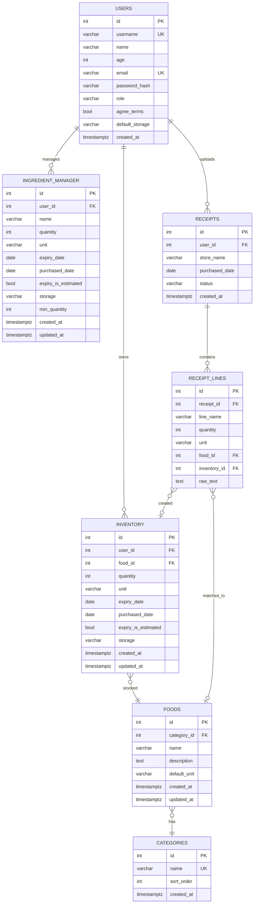

# Fridge ERD

`backend/apps/fridge` 도메인 및 연동 테이블(`users`, `ingredient_manager`) 기준입니다.  
Mermaid `erDiagram`은 속성·관계 라벨의 **따옴표·괄호·슬래시** 등에서 파싱 오류가 날 수 있습니다. 필드 설명은 아래 표를 참고하세요.

**영수증:** 촬영 이미지는 DB에 저장하지 않습니다. Gemini로 파싱한 메타·품목만 `receipts` / `receipt_lines`에 남기고, 품목은 `inventory`에 등록합니다.

## 포함관계

| 관계 | 설명 |
|------|------|
| USERS → INVENTORY | 1:N, 회원별 식품 마스터 기반 재고 (`ondelete=CASCADE`) |
| USERS → INGREDIENT_MANAGER | 1:N, 회원별 나만의냉장고 식재료 (`ondelete=CASCADE`) |
| USERS → RECEIPTS | 1:N, 영수증 파싱 이력 (`ondelete=CASCADE`) |
| CATEGORIES → FOODS | 1:N, 분류별 식품 마스터 (`ondelete=RESTRICT`) |
| FOODS → INVENTORY | 1:N, 동일 식품의 회원별 재고 행 (`ondelete=CASCADE`) |
| RECEIPTS → RECEIPT_LINES | 1:N, 영수증별 품목 줄 (`ondelete=CASCADE`) |
| RECEIPT_LINES → FOODS | N:1, 품목명 매칭·신규 식품 생성 후 연결 (`SET NULL`) |
| RECEIPT_LINES → INVENTORY | N:1, 파싱 품목이 만든 재고 행 (`SET NULL`) |

## 테이블·모델 매핑

| DB 테이블 | SQLAlchemy 모델 | 경로 |
|-----------|-----------------|------|
| `users` | `User` | `backend/apps/models/user.py` |
| `categories` | `FridgeCategory` | `backend/apps/fridge/models/category.py` |
| `foods` | `FridgeFood` | `backend/apps/fridge/models/food.py` |
| `receipts` | `FridgeReceipt` | `backend/apps/fridge/models/receipt.py` |
| `receipt_lines` | `FridgeReceiptLine` | `backend/apps/fridge/models/receipt.py` |
| `inventory` | `FridgeInventory` | `backend/apps/fridge/models/inventory.py` |
| `ingredient_manager` | `IngredientManager` | `backend/apps/models/ingredient_manager.py` |

## 필드 설명

| 엔티티 | 필드 | 설명 |
|--------|------|------|
| USERS | username | 로그인 아이디 (2~20자, 유니크) |
| USERS | default_storage | 기본 보관 위치 (영수증→inventory 시 사용) |
| CATEGORIES | name | 분류명 (유니크) |
| FOODS | category_id | `categories.id` (미매칭 품목은 `기타` 분류에 생성) |
| FOODS | name | 식품명 |
| RECEIPTS | user_id | `users.id` |
| RECEIPTS | store_name | 매장명 (파싱, 선택) |
| RECEIPTS | purchased_date | 구매일 (파싱, 없으면 당일) |
| RECEIPTS | status | `parsed` 등 |
| RECEIPT_LINES | line_name | 영수증 품목명 |
| RECEIPT_LINES | food_id | 매칭·생성된 `foods.id` |
| RECEIPT_LINES | inventory_id | 생성된 `inventory.id` |
| INVENTORY | user_id, food_id | 회원 재고 (영수증 스캔 시 자동 생성) |
| INGREDIENT_MANAGER | name | 자유 입력 식재료 (`foods`·영수증 흐름과 별도) |

## API

| 메서드 | 경로 | 설명 |
|--------|------|------|
| POST | `/receipts/scan` | 영수증 이미지 업로드 → Gemini 파싱 → `inventory` 등록 (이미지 미저장). 헤더 `X-User-Email` 필요 |

## 도메인 구분

| 영역 | API·레이어 | 설명 |
|------|------------|------|
| 식품 마스터·재고 | `category` / `food` / `inventory` | 분류·식품·회원 재고 |
| 영수증 | `receipt_router`, `receipt_service` | 촬영→파싱→inventory (구 `codes`/바코드 대체) |
| 나만의냉장고 | `ingredient_router` | `ingredient_manager`, 수동 입력 |

## 비고

- ~~`codes` (바코드)~~ → **`receipts` / `receipt_lines`** 로 대체 (Alembic `e7f8a9b0c1d2`).
- `inventory`는 식품 마스터(`foods`)에 묶인 재고이고, `ingredient_manager`는 이름 기반 개인 식재료로 **서로 FK 없음**.
- 공통 PK는 `EntityIdMixin`의 `id` (INTEGER, autoincrement)입니다.

**FRIDGE ERD**
- users 사용자의 아이디 비밀번호
- ingredint_manager 내가 평소에 늘 사두고 관리하고싶은 식재료 따로 저장
- receipts 영수증(전체)
- receipt_lines 영수증세부항목(한줄한줄)
- inverntory 내 진짜 냉장고 재고
- food 기본 등록되어있는 음식
- categories 채소, 과일 이런 종류